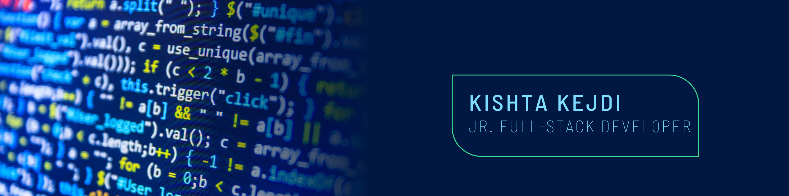

## 👋  Hi everyone! I'm Kejdi

  I'm a Junior Full-Stack Web Developer

### 👨🏻‍💻 &nbsp;About Me

  During my studies in accounting, I had the opportunity to approach the world of programming for the first time, which deeply fascinated me. Later, I decided to pursue in-depth studies in programming and IT. I am attracted to this field beacause of its vastness and constant evolution, offering endless opportunities to create innovative solutions and tackle everyday challenges.

### 👷‍♂️ &nbsp;Tech Stack

&nbsp;&nbsp; &nbsp;&nbsp;&nbsp;&nbsp;&nbsp;&nbsp;&nbsp;&nbsp;&nbsp;&nbsp;

### ⚙️ &nbsp;GitHub Analytics

### 🤝🏻 &nbsp;Connect with Me

